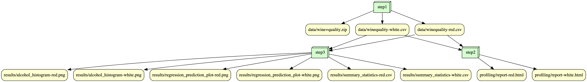

# Overview

The datasets that I selected is "Wine Quality" which contains both red and white wines dataset. Each dataset contains 12 input variables and a output variable "quality" which in the analysis script we will try to use the 12 input variables to predict the quality. There are three scripts that would be used to reproduce this project. The scripts are to download the datasets file, profile the data, and do analyzation on the data. 

# Analysis

After running the workflow, we will first download the two datasets and then store six files in the results folder after analzation. There will be graph that demonstrate the prediction versus actual which we could see how the prediction on the 12 input variables do. There are also histogram that are used to show the distribution of the alcohol of both white and red wine. From the distribution we can see that both of them are skewed to the right. The summary statistics shows the statistics of all 12 input variables which we could also use to learn about the distribution. 

# Workflow

Make sure to run "pip install -r requirements.txt" before running the script

# Reproducing

* Clone the GitHub respository containing the srcipts folder and docker image(qua65/is477-fall2023:assignment3). 

* Run first command: docker run --rm -v ${PWD}:/is477 qua65/is477-fall2023:final-project python prepare_data.py 

* Run second command: docker run --rm -v ${PWD}:/is477 qua65/is477-fall2023:final-project python profile.py 

* Run third command: docker run --rm -v ${PWD}:/is477 qua65/is477-fall2023:final-project python analysis.py

# License

I choose to use the Creative Commons Attribution 4.0 (CC-BY-4.0) which covers the content and data for my software. It only requires attribution instead of share-alike features of my software. I do not think the need of requiring share-alike is important since the development could be more freely without the limitation of share-alike features. Others could use the data or content to make improvement on or even create a better software. 

# References

Cortez,Paulo, Cerdeira,A., Almeida,F., Matos,T., and Reis,J.. (2009). Wine Quality. UCI Machine Learning Repository. https://doi.org/10.24432/C56S3T.